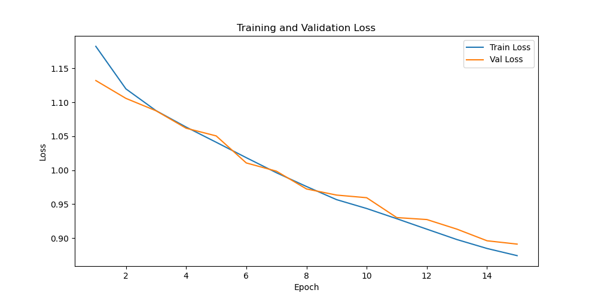
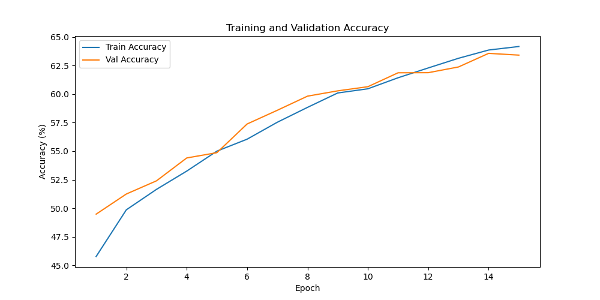

# Pre-Text Rotation Detection
> Related to Advanced Topics in Deep Learning (ATiDL) @ Summer 2024 - FAU Erlangen-Nürnberg

This is a personal project to test usecases for Geometric Transformation in a Pre-defined Pretext Task in Self-Supervised Learning (SSL) Area. Rotation prediction is chosen based on a simple ConvNet architecture on a [imagenette2](https://github.com/fastai/imagenette) dataset. 


## Getting started!

You can simply install the required libraries using `pip`:

```
pip install -r requirements.txt
```

## Machine Specifications
- **Operating System:** Windows 11
- **Processor:** Intel Core i5-11400F
- **RAM:** 16 GB
- **Graphics Card:** Nvidia RTX 3060
- **Python Version:** 3.11.7


## Training

You can simply run the following Python command in the code folder: 
```
python pretext_rotation_detection.py
```

## Loss and Accuracy Curves
- **Time Elapsed:** 55.64 min
- **Epochs:** 15

Below are the loss and accuracy curves obtained during training:

<div style="display: flex; flex-direction: row;">
  
  
</div>

